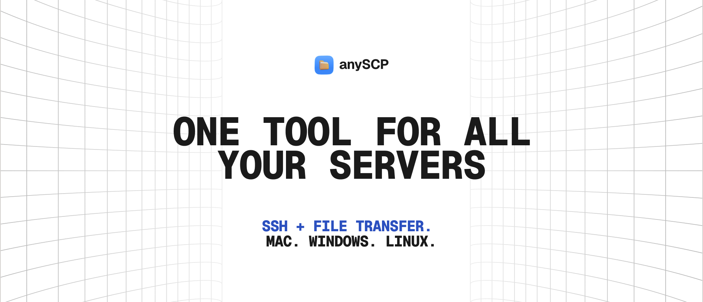
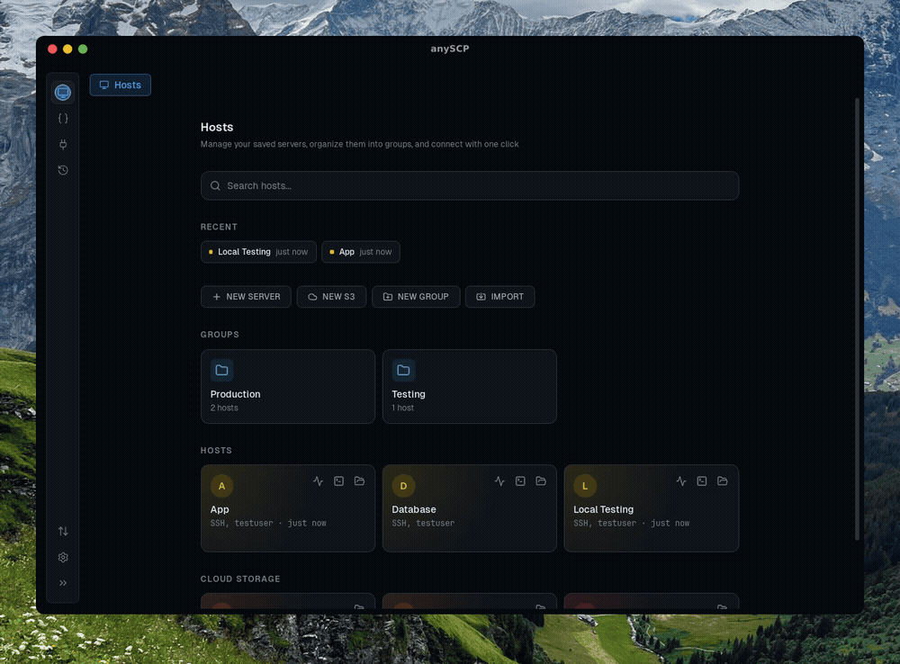
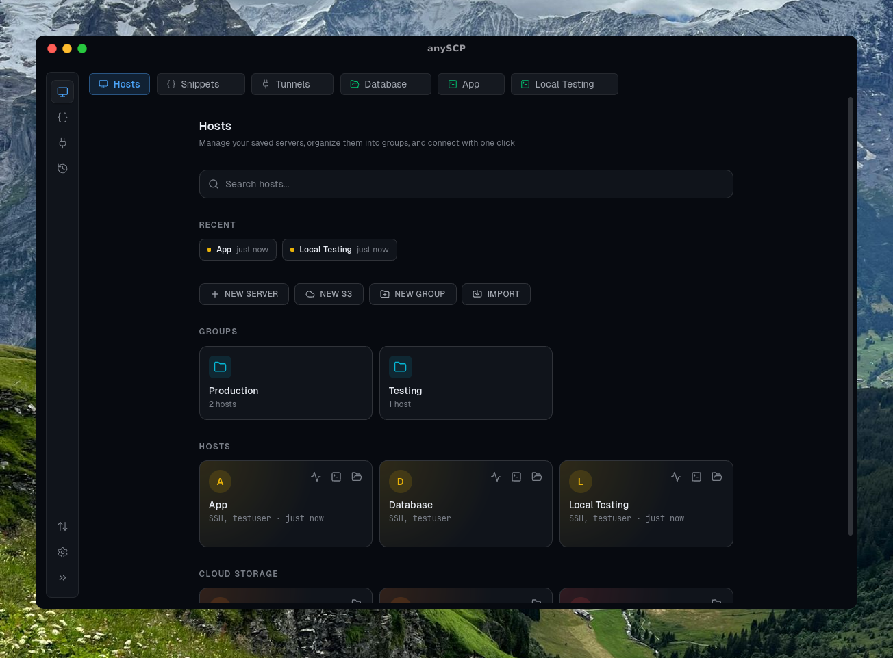
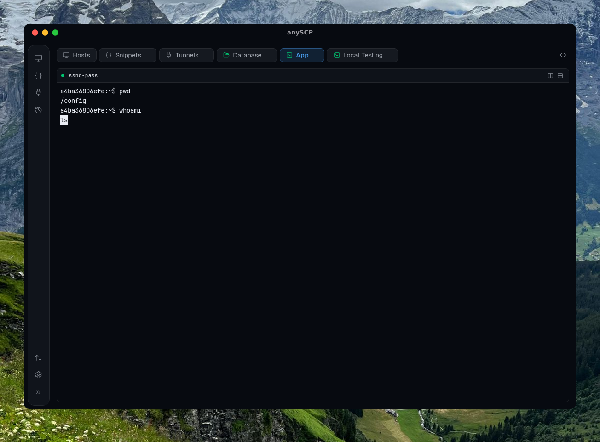
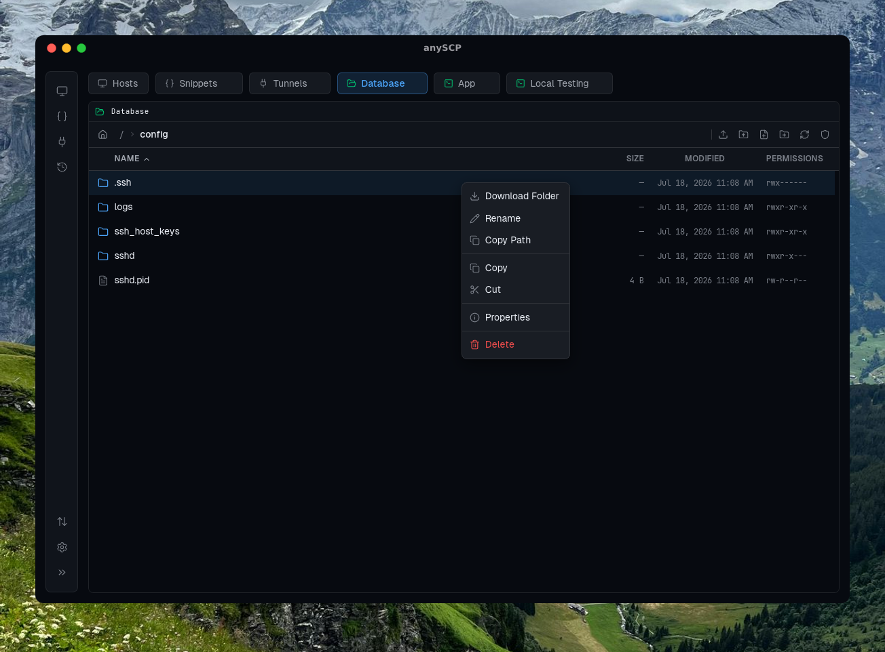
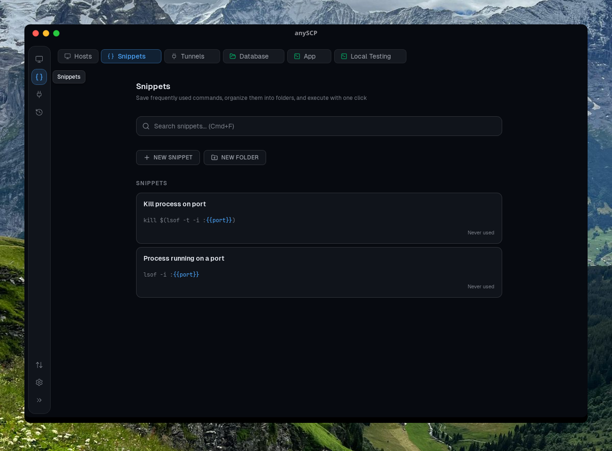

<p align="center">
  
</p>

<p align="center">
  <strong>A modern desktop client for SSH, SFTP, and S3 with a clean, powerful interface</strong>
</p>

<p align="center">
  <a href="#features">Features</a> &bull;
  <a href="#screenshots">Screenshots</a> &bull;
  <a href="#installation">Installation</a> &bull;
  <a href="#building">Building</a> &bull;
  <a href="#contributing">Contributing</a> &bull;
  <a href="#license">License</a>
</p>

<p align="center">
  <a href="https://github.com/macnev2013/anySCP/releases"></a>
  <a href="https://github.com/macnev2013/anySCP/releases"></a>
  
  <a href="LICENSE"></a>
  <a href="https://github.com/macnev2013/anySCP/stargazers"></a>
</p>

<p align="center">
  Free and open-source alternative to Termius, PuTTY, and WinSCP.<br/>
  A cross-platform SSH client, SFTP file manager, and S3 desktop browser with split panes, drag-and-drop uploads, and command snippets.
</p>

---

<p align="center">
  
</p>
<p align="center"><em>SSH terminals, SFTP file management, and S3 cloud storage -- all in one app.</em></p>

---

## 🚀 Overview

AnySCP is a free, open-source desktop application that combines an SSH terminal, SFTP file explorer, and S3-compatible cloud storage browser into a single, fast, privacy-first tool. Built with Tauri v2 (Rust backend + React frontend), it runs natively on macOS, Windows, and Linux. No cloud accounts, no subscriptions -- your credentials stay on your machine.

## ⚡ How AnySCP Compares

| Feature | AnySCP | Termius | PuTTY | WinSCP | Cyberduck |
|---------|--------|---------|-------|--------|-----------|
| SSH Terminal | Yes | Yes | Yes | No | No |
| SFTP Browser | Yes | Yes | No | Yes | Yes |
| S3 Browser | Yes | No | No | No | Yes |
| Split Panes | Yes | Yes | No | No | No |
| Port Forwarding | Yes | Yes | Yes | No | No |
| Command Snippets | Yes | Yes | No | No | No |
| Cross-Platform | Yes | Yes | Windows | Windows | Yes |
| Free (no limits) | Yes | No | Yes | Yes | Yes |
| No Account Required | Yes | No | Yes | Yes | Yes |
| Open Source | Yes | No | Yes | Yes | Yes (GPL) |
| Credential Privacy | Local (OS keychain) | Cloud-synced | Local | Local | Local |

## ✨ Features

### 💻 SSH Terminal Client
- Full-featured terminal emulator powered by xterm.js with GPU-accelerated WebGL rendering
- Split terminal panes (horizontal and vertical) within a single SSH session
- In-terminal search with regex support
- Tabbed SSH sessions with keyboard shortcuts
- Configurable keep-alive intervals, startup commands, default shell, and proxy jump (bastion host)
- SSH key authentication with automatic PPK-to-OpenSSH conversion
- Import connections from `~/.ssh/config`

### 📁 SFTP File Manager
- Browse, upload, download, rename, move, copy, and delete remote files and directories
- Drag-and-drop file upload from your desktop directly into the remote file browser
- Multi-select files with Ctrl+Click and Shift+Click for bulk operations
- Cut, copy, and paste files between remote directories
- Inline file and folder creation
- Edit remote files in VS Code -- automatically re-uploads when you save
- Transfer queue with real-time progress bars, transfer speed, and ETA
- Concurrent file transfers with configurable parallelism

### ☁️ S3 Cloud Storage Browser
- Connect to **Amazon S3**, **MinIO**, **Cloudflare R2**, **Backblaze B2**, **Wasabi**, **DigitalOcean Spaces**, or any S3-compatible storage service
- Same file browser UI as SFTP -- sort, multi-select, context menus, keyboard shortcuts
- Drag-and-drop upload with recursive directory support
- Create files, create folders, bulk delete (including recursive folder delete)
- Generate and copy presigned URLs for sharing
- Edit S3 objects in VS Code with automatic re-upload on save
- Transfer progress tracking with speed and ETA
- Switch between multiple buckets within a single connection

### 🔗 Server & Connection Management
- Save SSH hosts and S3 connections with labels, colors, environment tags, and notes
- Organize connections into color-coded groups
- Import SSH hosts from `~/.ssh/config` with one click
- One-click connect using credentials stored in your OS keychain
- Recent connections list for quick access
- Full connection history with audit log

### 📋 Command Snippets Library
- Save frequently used shell commands with labels and descriptions
- Create parameterized command templates with `{{variable}}` placeholders
- Organize snippets into folders
- Quick-insert panel accessible from any terminal session
- Full-text search across all saved snippets

### 🔀 SSH Port Forwarding
- Set up local and remote SSH tunnels
- Create, start, and stop port forwarding rules per host
- Tunnels create their own SSH connections automatically -- no terminal session needed
- Monitor active tunnel status in real time
- Presets for common services (PostgreSQL, MySQL, Redis, MongoDB, HTTP, Kubernetes)

### 🔐 Security & Privacy
- Credentials stored in your **OS keychain** (macOS Keychain, Windows Credential Manager, Linux libsecret/KWallet)
- SSH private keys and passwords never leave the Rust backend process
- Fully offline -- no internet connection required after installation
- Open source -- audit the code yourself

## 📸 Screenshots

| Connection Manager | SSH Terminal |
|:--:|:--:|
|  |  |
| *Organize servers with groups, colors, and tags* | *Split panes, search, and tabbed sessions* |

| File Explorer | Command Snippets |
|:--:|:--:|
|  |  |
| *SFTP & S3 with drag-drop, context menus* | *Parameterized templates with quick-insert* |

## 📥 Installation

### Download
1. Download the latest release from the [Releases](https://github.com/macnev2013/anySCP/releases) page
2. Choose the right file for your platform:
   - **macOS (Apple Silicon)**: `.dmg` (aarch64)
   - **macOS (Intel)**: `.dmg` (x64)
   - **Windows**: `.msi` or `.exe`
   - **Linux**: `.deb` or `.AppImage`
3. Install and launch

> **macOS note**: If you see "app is damaged", run: `xattr -cr /Applications/anyscp.app`

### Requirements
- macOS 11+, Windows 10+, or Linux (Ubuntu 22.04+)
- For SFTP: SSH access to remote servers
- For S3: Access key and secret key (or S3-compatible credentials)

## 🔨 Building

### Prerequisites
- [Node.js](https://nodejs.org) 18+
- [pnpm](https://pnpm.io)
- [Rust](https://rustup.rs) (latest stable)
- Platform-specific Tauri dependencies: [Tauri prerequisites](https://v2.tauri.app/start/prerequisites/)

### Build Instructions

```bash
# Clone the repository
git clone https://github.com/macnev2013/anyscp.git
cd anyscp

# Install frontend dependencies
pnpm install

# Run in development mode (hot-reload)
pnpm tauri dev

# Build for production (generates platform-specific installer)
pnpm tauri build
```

## 🛠 Tech Stack

| Layer | Technology |
|-------|-----------|
| Desktop runtime | [Tauri v2](https://v2.tauri.app) |
| Backend | Rust (tokio, russh, russh-sftp, rust-s3, rusqlite) |
| Frontend | React 19, TypeScript (strict), Tailwind CSS v4 |
| Terminal | xterm.js with WebGL renderer |
| State management | Zustand |
| Credential storage | OS keychain via `keyring` crate |
| Database | SQLite (bundled, zero config) |

## 🏗 Architecture

AnySCP follows a strict frontend/backend separation:

- **Rust does the heavy lifting** -- all SSH, SFTP, S3, encryption, and file I/O runs in Rust
- **React is a thin view layer** -- renders UI and manages local state via Zustand
- **Tauri IPC** bridges the two with type-safe commands (request/response) and events (server push)
- **Credentials never cross the IPC boundary** -- the frontend never sees passwords or private keys
- **Shared `FileSystemProvider` abstraction** -- SFTP and S3 browsers use identical UI components with capability flags that show/hide features per protocol

### Project Structure

```
src/                          # React frontend
  components/
    terminal/                 # SSH terminal, split panes, search
    explorer/                 # Shared file table, toolbar, drop zone
    sftp/                     # SFTP browser, session tabs
    s3/                       # S3 browser, connect dialog
    dashboard/                # Host cards, groups, connection manager
    snippets/                 # Command snippet library
    transfers/                # Transfer progress popover
  stores/                     # Zustand state stores
  providers/                  # SFTP & S3 file system providers
  types/                      # TypeScript type definitions

src-tauri/src/                # Rust backend
  ssh/                        # SSH connections, PTY, key management
  sftp/                       # SFTP sessions, transfer manager
  s3/                         # S3 sessions, transfer manager
  db/                         # SQLite persistence layer
  vault/                      # OS keychain integration
  snippets/                   # Snippet storage
  portforward/                # SSH tunnel management
  import/                     # SSH config parser
```

## 🤝 Contributing

Contributions are welcome! Here's how you can help:

1. **Fork the repository**
2. **Create a feature branch**: `git checkout -b feature/amazing-feature`
3. **Commit your changes**: `git commit -m 'Add amazing feature'`
4. **Push to the branch**: `git push origin feature/amazing-feature`
5. **Open a Pull Request**

Please open an issue first to discuss what you'd like to change.

## 🐛 Troubleshooting

### SSH Connection Issues
- **Can't connect**: Verify host, port, username, and credentials
- **Authentication failed**: Check password or SSH key permissions
- **Timeout**: Check firewall settings and network connectivity

### S3 Connection Issues
- **Access Denied**: Verify your access key and secret key are correct
- **Bucket not found**: Check the bucket name and region settings
- **Invalid credentials**: Ensure IAM user has S3 permissions

### File Operations
- **Permission denied**: Ensure your user has appropriate file permissions
- **Upload failed**: Check available disk space on remote server

### macOS
- **"App is damaged"**: Run `xattr -cr /Applications/anyscp.app`

## 📄 License

This project is licensed under the MIT License -- see the [LICENSE](LICENSE) file for details.

## 🙏 Acknowledgments

- Built with [Tauri](https://tauri.app) by the Tauri team
- SSH implementation powered by [russh](https://github.com/warp-tech/russh)
- Terminal emulation powered by [xterm.js](https://xtermjs.org)
- S3 support powered by [rust-s3](https://github.com/durch/rust-s3)

## 💬 Support

- **Issues**: [GitHub Issues](https://github.com/macnev2013/anySCP/issues)
- **Discussions**: [GitHub Discussions](https://github.com/macnev2013/anySCP/discussions)

---

<p align="center">
  If you find AnySCP useful, please consider giving it a <a href="https://github.com/macnev2013/anySCP">star on GitHub</a>!
</p>

<p align="center">
  <a href="#top">Back to top</a>
</p>
